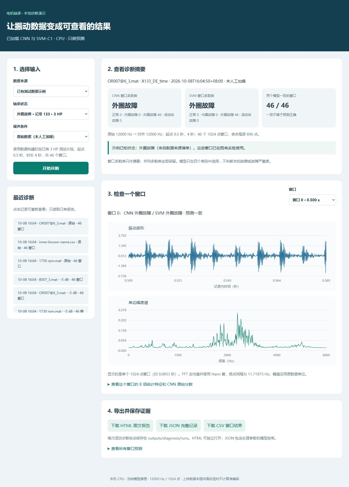
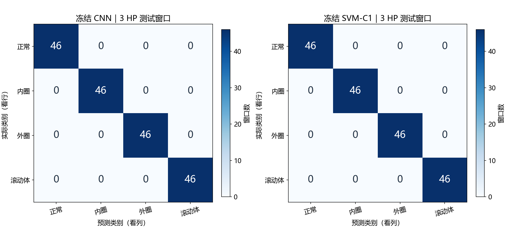
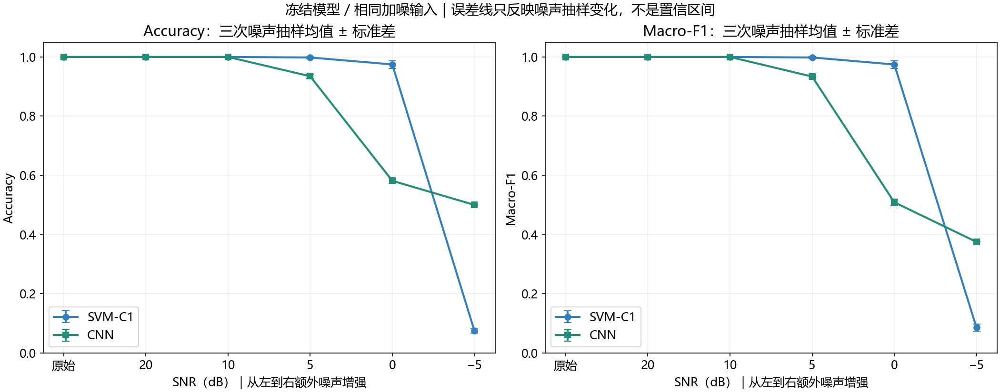

# 电机轴承振动故障智能诊断系统

基于 CWRU 轴承振动数据的四分类诊断原型，完成数据预处理、统计特征基线、PyTorch 一维 CNN、独立负载测试、人工噪声实验，以及本地诊断界面和报告导出。

**Python · SciPy · scikit-learn · PyTorch · HTML / CSS / JavaScript**



## 项目做了什么

- **数据处理**：读取 MAT 驱动端信号，将正常记录从 48 kHz 重采样到 12 kHz；逐记录截取和切窗，保存标签、来源索引与训练集标准化参数。
- **传统模型**：提取 RMS、标准差、绝对峰值、峰峰值、平均绝对值、峰值因子、偏度、Pearson 峭度八项特征，对比 SVM 与随机森林，由验证集选择基线。
- **深度学习**：使用含两组卷积、池化和全局平均池化的小型 1D-CNN，完成训练、验证、权重保存及加载推理。
- **评估与分析**：在留出的 3 HP 负载记录上计算准确率、Macro-F1、各类召回率和混淆矩阵；对同一测试窗口施加固定人工噪声，比较模型退化。
- **诊断演示**：提供本地网页，支持 MAT / 单列 CSV 导入、波形与频谱查看、CNN / SVM 对比、窗口预测以及 HTML / JSON / CSV 报告导出。

## 数据与实验协议

使用 [CWRU Bearing Data Center](https://engineering.case.edu/bearingdatacenter/download-data-file) 的 16 条记录，包含正常、内圈、外圈、滚动体四类；故障直径为 0.007 英寸，外圈选择 6 点钟位置。每类覆盖 0、1、2、3 HP 四个负载。

| 设置 | 本实验值 |
| --- | --- |
| 输入通道 | 驱动端 DE，单通道 |
| 对齐采样率 | 12,000 Hz |
| 每条截取范围 | 从 0.5 秒开始，持续 4 秒 |
| 窗口 | 1024 点、非重叠；每条 46 个完整窗口 |
| 训练集 | 0 / 1 HP，8 条记录、368 个窗口 |
| 验证集 | 2 HP，4 条记录、184 个窗口 |
| 测试集 | 3 HP，4 条记录、184 个窗口 |
| CNN 输入 | `(batch, 1, 1024)` |
| CNN 训练 | CPU、30 轮、batch size 32、seed 42 |

集合按完整记录和负载划分；训练、验证、测试不共享同一条记录。每条记录尾部不足 1024 点的 896 点分别舍弃。CNN 标准化参数仅由训练集计算；特征分类器的预处理也仅在训练集拟合。模型选择使用验证集，测试集用于最终评估。

详细数据编号、来源和复现步骤见 [复现说明](docs/REPRODUCING.md)。

## 已有实验结果

下面展示实际运行的实验结果，数值文件保存在 [reports/reference](reports/reference)。公开目录重新训练时会生成自己的 `outputs/`，应以本次实际输出为准。

| 原始信号测试，184 个窗口 | 准确率 | Macro-F1 |
| --- | --- | --- |
| 验证集选中的 SVM-C1 | 100% | 1.0000 |
| 1D-CNN | 100% | 1.0000 |



这组结果来自 **同一 CWRU 实验台、留出负载条件下的窗口分类**。184 个窗口来自 4 条测试记录，不能当作 184 次独立设备试验；结果不能直接证明对新轴承、新设备或工业现场同样有效。

人工噪声使用预先固定的三个噪声种子；下表是相同测试窗口在三个噪声实现上的平均准确率。

| 条件 | SVM | 1D-CNN |
| --- | --- | --- |
| 20 dB | 100.00% | 100.00% |
| 10 dB | 100.00% | 100.00% |
| 5 dB | 99.82% | 93.48% |
| 0 dB | 97.46% | 58.15% |
| −5 dB | 7.43% | 50.00% |



模型各有失败条件，CNN 没有在所有噪声条件下优于传统模型。这里的人工噪声实验用于分析敏感性，不等同于现场噪声验证。

## 快速复现

已验证的实验环境为 Windows、Python 3.14、CPU PyTorch。依赖版本记录在 [requirements.txt](requirements.txt)。

在仓库根目录执行：

```powershell
python -m venv .venv
.venv\Scripts\python.exe -m pip install --upgrade pip
.venv\Scripts\python.exe -m pip install torch==2.12.0 --index-url https://download.pytorch.org/whl/cpu
.venv\Scripts\python.exe -m pip install -r requirements.txt
.venv\Scripts\python.exe -X utf8 scripts/run_pipeline.py
```

最后一行依次准备官方数据、构建数据集、训练基线、训练 CNN、评估测试集、运行噪声实验。首次需要联网下载官方 MAT；已有合法数据时可按说明放到指定目录，并使用 `--skip-download`。

训练完成后启动界面：

```powershell
.venv\Scripts\python.exe -X utf8 app/server.py --open-browser
```

访问 `http://127.0.0.1:8879`。服务只监听本机；关掉启动窗口或按 Ctrl+C 即可停止。模型输出分数未经置信度校准，界面不提供未知故障拒识。

MAT、处理后数据、权重和诊断历史由脚本在本地生成，均已加入 `.gitignore`。公开仓库保留代码、配置、项目说明与选定实验结果。

## 目录

```text
app/                 本地网页、输入检查、推理及报告导出
configs/             固定的处理、训练、评估与噪声参数
src/                 CNN 网络及噪声工具
scripts/             下载、数据构建、训练、评估与校验脚本
docs/                复现说明与项目配图
reports/reference/   原工程的实验数值，供结果核查
data/                本地下载及生成的数据（不提交）
outputs/             本地训练产物与诊断记录（不提交）
```

Windows 安装依赖后，也可使用 `run_pipeline.bat` 运行完整流程，使用 `run_app.bat` 启动诊断界面。

## 数据来源与授权范围

原始记录来自 CWRU，仓库提供官方来源与下载脚本，不重新分发 MAT。请在使用数据的工作中注明数据来源。

本仓库用于公开展示工程成果，暂未添加开源授权协议。数据、第三方依赖与本仓库代码的授权范围分别说明于 [NOTICE.md](NOTICE.md)。
